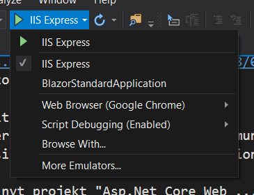

Jeg har brugt https://www.codemag.com/Article/1809061/Re-Assembling-the-Web-with-Web-Assembly-and-Blazor
(Rick Strahls artikel i Visual Studio Magazine) til at komme igang med Blazor.
Jeg har også kigget på https://blogs.msdn.microsoft.com/webdev/2018/03/22/get-started-building-net-web-apps-in-the-browser-with-blazor/
(msdn-blog, en komme-i-gang med Blazor artikel)

__Her er hvad jeg lavede fredag 7/9-2018:__

Man skal installere nogle prerequisites for at det virker:
  - Visual Studio 2017 update 7 eller senere (jeg har pt. 2017 Community update 8, 3. udgave (fuld version 15.8.3))
	- .Net Core Blazor Language Extension (tror jeg nok) - en extension til Visual Studio, der er i "Tools", "Extension and Updates" menuen

Så har jeg i Visual Studio lavet et nyt projekt "Asp.Net Core Web ..." og så skal man i wizard'en markere "Blazor"

Så stod der i msdn-blog artiklen at F5 for at debugge ikke virker i Visual Studio, men at Ctrl-F5 (uden debugning)
fungerer. Jeg fik en "HTTP Error 502.5 - Process Failure" fejl i Edge browseren når jeg prøvede med Ctrl-F5.
Jeg prøvede i Visual Studio at ændre standard browser til Chrome:

Jeg fik samme fejl.
Så prøvede jeg at klikke på det shortcut, der var i fejl-beskeden i browseren 
(https://docs.microsoft.com/en-us/aspnet/core/host-and-deploy/iis/troubleshoot?view=aspnetcore-2.1)
Der var ikke rigtig noget der fangede. Der var et punkt i shortcuttet "Application Event Log" og med
det fandt jeg en fejl "IIS Express AspNetCore Module" fejl med en errorcode 0x80004005.
Og med et søgte jeg på Google efter "blazor error code 0x80004005" og det første hit (https://github.com/aspnet/Blazor/issues/1342) 
sagde at man enten skulle slette global.json eller ændre den til at indeholde ens nuværende version af .Net Core.
I en Visual Studio Command Prompt kan man udføre "dotnet --info" og med den fik min seneste version til 2.1.401,
så jeg ændrede global.json fra "sdk": { "version": "2.1.300" ...
                           til "sdk": { "version": "2.1.401"
Og så virkede det "HURRA!".

Og F5 virker også, så Ctrl-F5 er åbenbart ikke nødvendigt.

__Her er hvad jeg lavede lørdag 8/9-2018:__

Jeg prøvede at lave en Markdown fil (.md). Jeg søgte efter en Markdown add-in til
Visual Studio og Mads Kristensen har lavet en - og den fungerer fint - den viser
hvordan markdown filen ser ud ved siden af. Det fungerer fint.
Et par markdown ting jeg har lært: 
* \!\ for at vise et billede, url kan bare være en lokal sti til filen.
* \__ (dobbelt understregning) for at lave en understregning af en tekst

TODO:
* smid det her i github f.eks. eller VSTS for at gemme koden og versioner
* fortsætte med artiklen